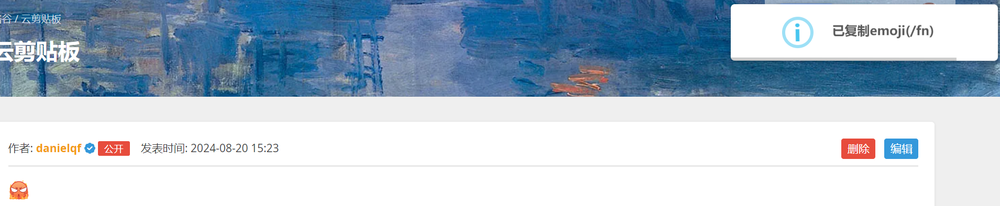

# QQEmojiRenderer

~~省流：套壳软件~~

## Usage

### Installation

1. Download [QQEmojiRenderer.zip](https://github.com/danielqfmai/QQEmojiRenderer/archive/refs/heads/master.zip) or clone this repository.
2. Unzip the file.
3. Run `download_requirements.sh`.
  - For windows, rename `download_requirements.sh` to `download_requirements.bat` and run it.
4. Open the extensions page in your browser.
5. Enable developer mode.
6. Drag the folder into the page.

### Features

- Render QQ Emojis (only for www.luogu.com.cn and www.luogu.com now).
  - Hover over the Emoji image to see the code.
    
    
  - Click the Emoji image to copy the code.
    
    
- Auto completion.
  
  
  - Test it in the popup window.
    
    

## Acknowledgements

- [LuoguEmojiSender](https://github.com/Maxmilite/LuoguEmojiSender)
- [Luogu QQ 表情显示](https://greasyfork.org/zh-CN/scripts/494552-luogu-qq-%E8%A1%A8%E6%83%85%E6%98%BE%E7%A4%BA)
- [Tribute](https://github.com/zurb/tribute)
